# MongoDB is a DBMS
- NoSQL
- DataStorage -> DB
- Famous DB
- used mostly in Data Analysis, Data Science & Application Development...
(concept = what is it ? why (which is important, logical reasons), how is easy ?)

-it is a Document oriented


mongoDB terms comes from mongo means huge/


Limitations of RDBMS


MongoDB can store Flexible data


now a days, data is important, data driven decisions
with data we do storage and computation.

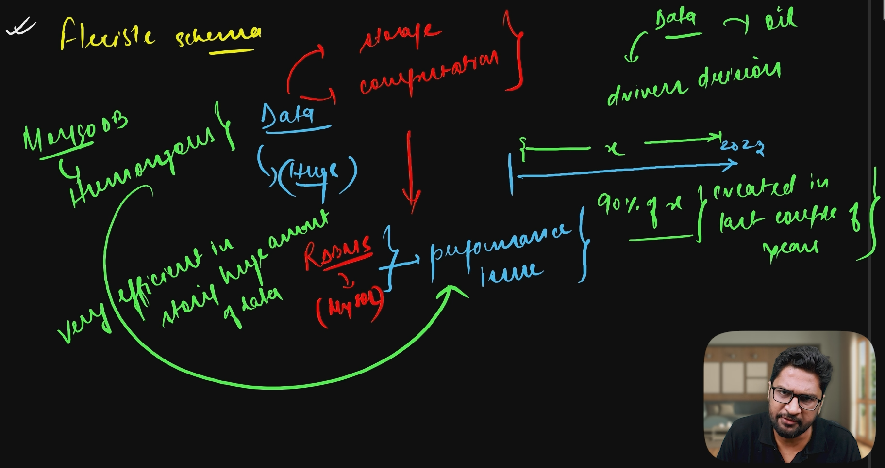

mongoDB is open source NoSQL based DBMS and can store huge amount of data in the efficient way.
It allows to store data with flexible schema.(means parameters are not fixed)
It can store huge amount of data natively.
It Stores Data in the forms of collections and documents
It Gained Popularity in mid 2000's

It is Natively Scalable
It is a flexible schema


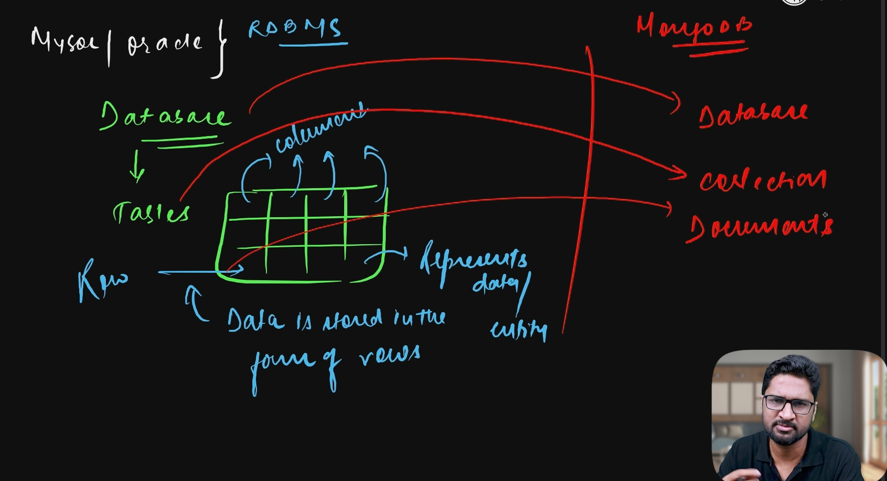

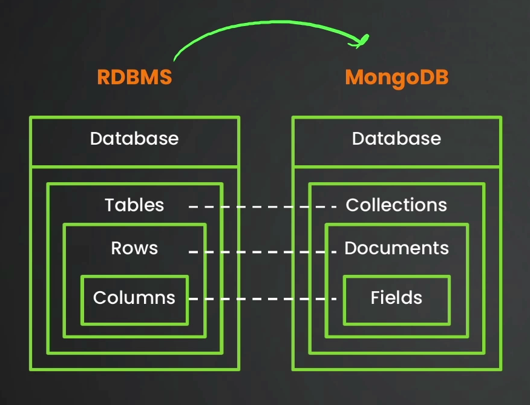


 mongodb server


comparision of rdbms vs nosql


Advantages
mongodb comes with 2 types = free and support
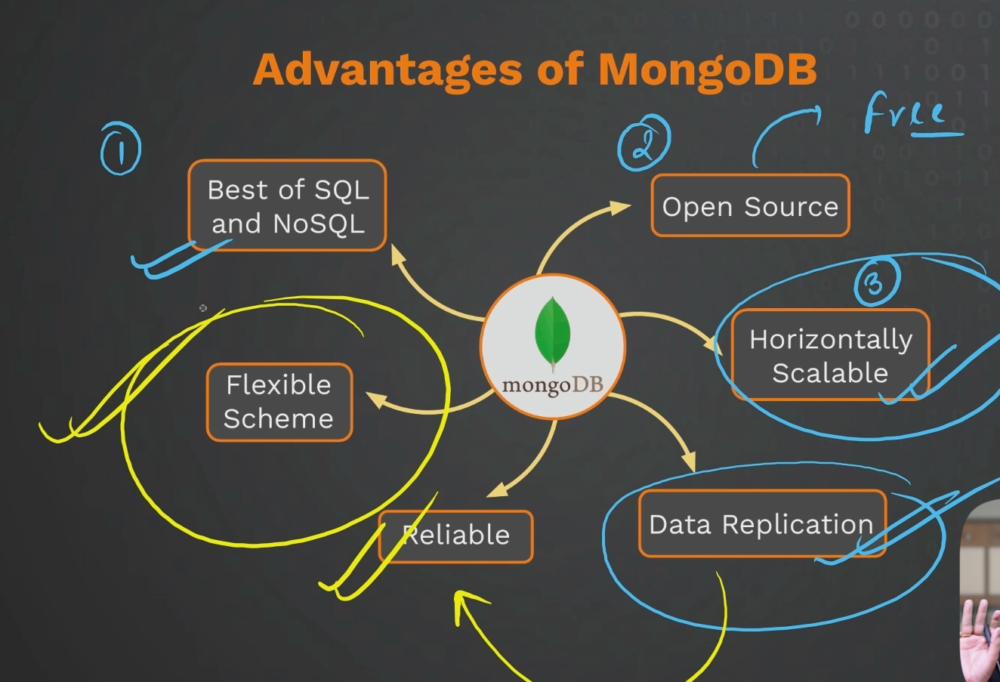

Scalabiliy problem in rdbms


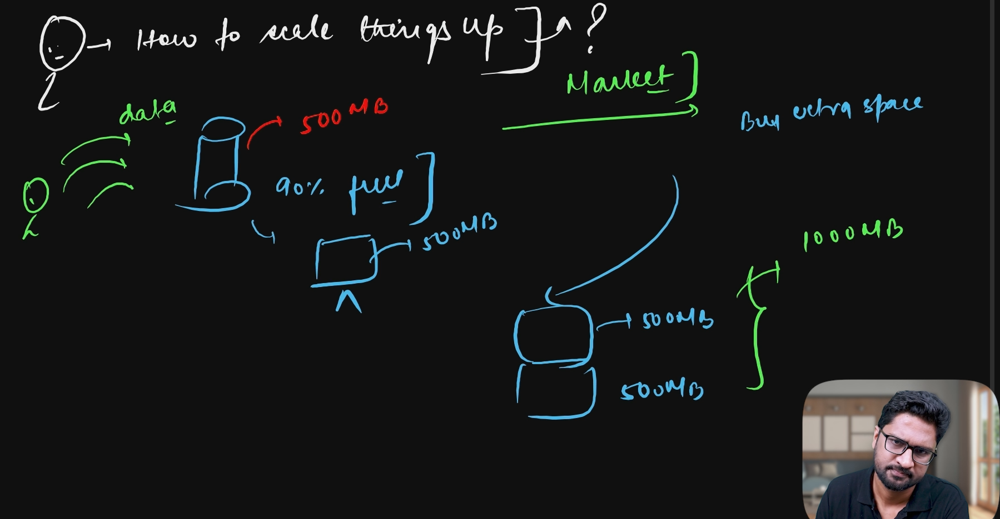
same machine configurations are increasing


vertical scaling has it's limits.

Horizontal Scaling is best suited


INDUSTRIES


## USE CASES
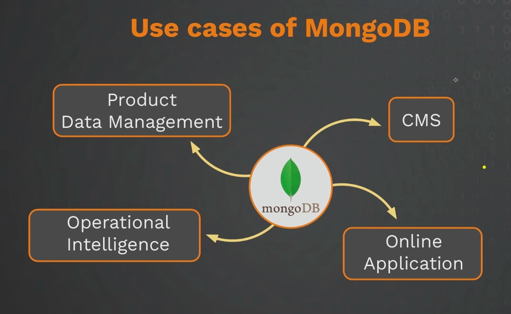
CMS = CONTENT MANAGEMENT SYSTEM =>blog posts,likes and comments
startUp's = product data managements
operation intelligence = to perform analysis.
online applications = transcactions, online,..


Sharding in MongoDB


if in sharding one db fails, then what = > solution is data replication.
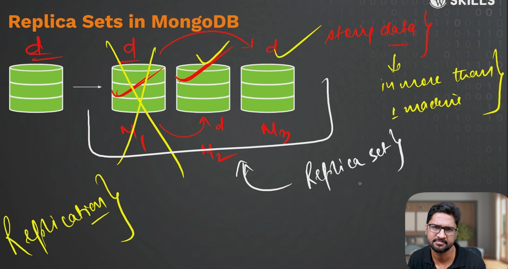


mongoDB is scalable because it is


## How MongoDB stores Data
It is the binary serialization over the JSON
MongoDB store data in less space
It supports large number of data types

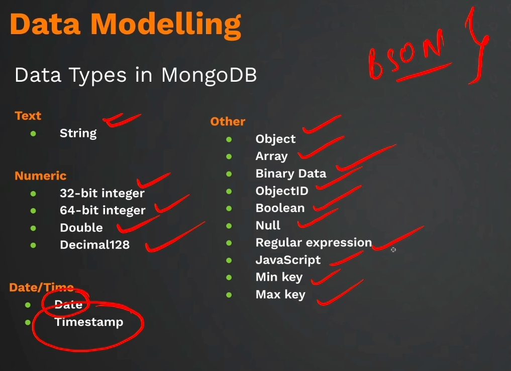

mongo db stores data in the form of documents
why BSON ? less space,
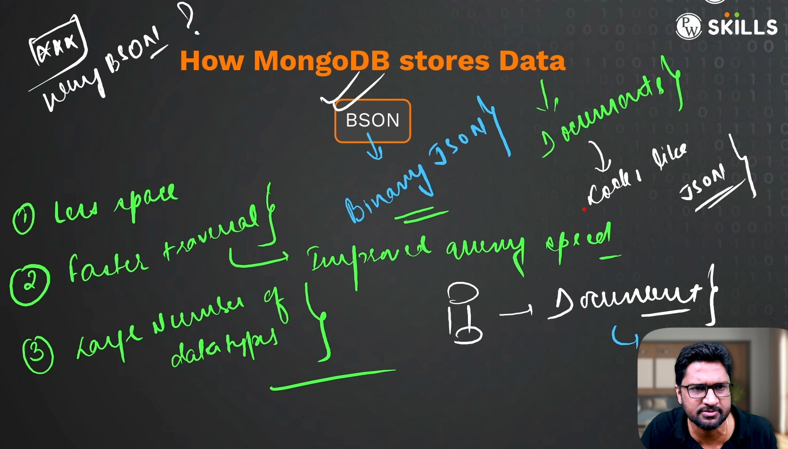
1 documents supports size of 16mb. (not more than that.(limitation and fact.))


real world entities are represented as documents (BSON)


when data modeling is done. then relationships among it has to be represented then
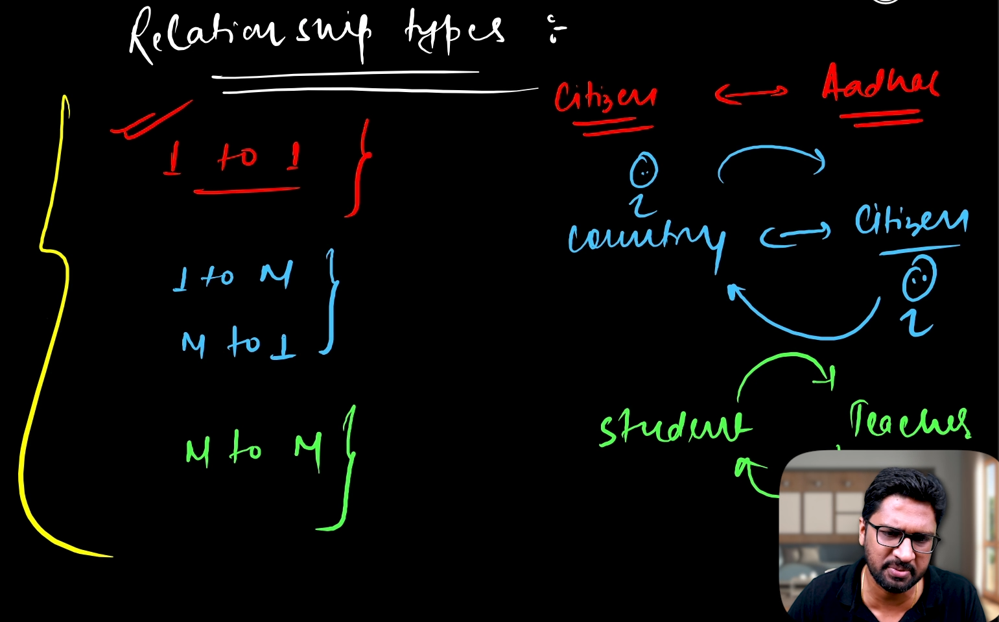


transaction is little bit complemented is a limitation in reference


///////////////////////////////////////////////////
by default mongo db shell is on test database.
```MongoDB
newdb> use picollege;
picollege> db.createCollection("students");
> show collections;
> db.students.renameCollection("students_new");
picollege> db.students.remove({});
picollege> db.students_new.drop();
newdb> var user = {
... name : "sidduganesh",
... ip : "192.168.0.1",
... lastLoginTime : 93838928834
... };

//document
newdb> user;
{ name: 'sidduganesh', ip: '192.168.0.1', lastLoginTime: 93838928834 }

//document inserted in the collection
newdb> db.students.insertOne(user);
{
  acknowledged: true,
  insertedId: ObjectId('65d9a90acb8562ab522561ce')
}

//insert multiple docs
newdb> db.students.insertMany([{name:"aakashganesh", ip : "127.0.0.1"},{name: "jyothi", work:"tailoring"}]);
{
  acknowledged: true,
  insertedIds: {
    '0': ObjectId('65d9a9ddcb8562ab522561cf'),
    '1': ObjectId('65d9a9ddcb8562ab522561d0')
  }
}

//retrieving
newdb> db.students.find();
[
  {
    _id: ObjectId('65d9a90acb8562ab522561ce'),
    name: 'sidduganesh',
    ip: '192.168.0.1',
    lastLoginTime: 93838928834
  },
  {
    _id: ObjectId('65d9a9ddcb8562ab522561cf'),
    name: 'aakashganesh',
    ip: '127.0.0.1'
  },
  {
    _id: ObjectId('65d9a9ddcb8562ab522561d0'),
    name: 'jyothi',
    work: 'tailoring'
  }
]

//find by
newdb> db.students.find({name: "jyothi"})
[
  {
    _id: ObjectId('65d9a9ddcb8562ab522561d0'),
    name: 'jyothi',
    work: 'tailoring'
  }
]

//inserting nested document
newdb> var n_user = { name: "sid", job : { title: "programmer", salary: 25000}};

newdb> db.students.insertOne(n_user);
{
  acknowledged: true,
  insertedId: ObjectId('65d9ab66cb8562ab522561d1')
}

//filter based on the nested document
newdb> db.students.find({'job.title' : 'programmer'});
[
  {
    _id: ObjectId('65d9ab66cb8562ab522561d1'),
    name: 'sid',
    job: { title: 'programmer', salary: 25000 }
  }
]

//filter based on first letter  (regular expression) /  /
newdb> db.students.find({name: /j.*/})
[
  {
    _id: ObjectId('65d9a9ddcb8562ab522561d0'),
    name: 'jyothi',
    work: 'tailoring'
  }
]

//to analysis document structure 
newdb> db.students.find().limit(2);
[
  {
    _id: ObjectId('65d9a90acb8562ab522561ce'),
    name: 'sidduganesh',
    ip: '192.168.0.1',
    lastLoginTime: 93838928834
  },
  {
    _id: ObjectId('65d9a9ddcb8562ab522561cf'),
    name: 'aakashganesh',
    ip: '127.0.0.1'
  }
]

//skip()
newdb> db.students.find().skip(2);
[
  {
    _id: ObjectId('65d9a9ddcb8562ab522561d0'),
    name: 'jyothi',
    work: 'tailoring'
  },
  {
    _id: ObjectId('65d9ab66cb8562ab522561d1'),
    name: 'sid',
    job: { title: 'programmer', salary: 25000 }
  }
]

//function or method
// 1 means ascending order , -1 means descending order
newdb> db.students.find().sort({name: 1});
[
  {
    _id: ObjectId('65d9a9ddcb8562ab522561cf'),
    name: 'aakashganesh',
    ip: '127.0.0.1'
  },
  {
    _id: ObjectId('65d9a9ddcb8562ab522561d0'),
    name: 'jyothi',
    work: 'tailoring'
  },
  {
    _id: ObjectId('65d9ab66cb8562ab522561d1'),
    name: 'sid',
    job: { title: 'programmer', salary: 25000 }
  },
  {
    _id: ObjectId('65d9a90acb8562ab522561ce'),
    name: 'sidduganesh',
    ip: '192.168.0.1',
    lastLoginTime: 93838928834
  }
]
//to know collection size
newdb> db.students.find().count();
4

//mathematical operations
newdb> db.students.find({'job.salary': {$lt: 300000}});
[
  {
    _id: ObjectId('65d9ab66cb8562ab522561d1'),
    name: 'sid',
    job: { title: 'programmer', salary: 25000 }
  }
]

//UPDATE


/////doubt///
picollege> db.students.drop;
[Function: drop] AsyncFunction {
  apiVersions: [ 1, Infinity ],
  returnsPromise: true,
  serverVersions: [ '0.0.0', '999.999.999' ],
  topologies: [ 'ReplSet', 'Sharded', 'LoadBalanced', 'Standalone' ],
  returnType: { type: 'unknown', attributes: {} },
  deprecated: false,
  platforms: [ 'Compass', 'Browser', 'CLI' ],
  isDirectShellCommand: false,
  acceptsRawInput: false,
  shellCommandCompleter: undefined,
  help: [Function (anonymous)] Help
}


```
test and newdb are logically present it doesn't have the data in it.

if data has, then shows >show dbs; dbs are shown
until collections are not created inside the dbs it is present in logical presence, not doesn't shows the dbs


cmd's are bellow

earlier times
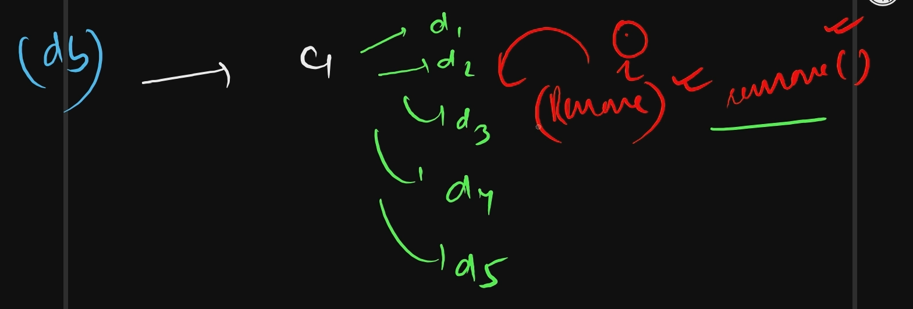
-----------------------


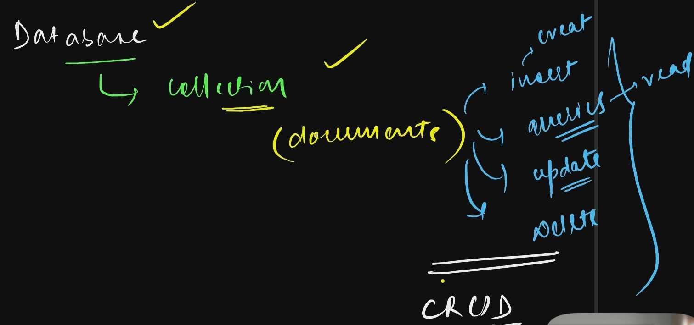


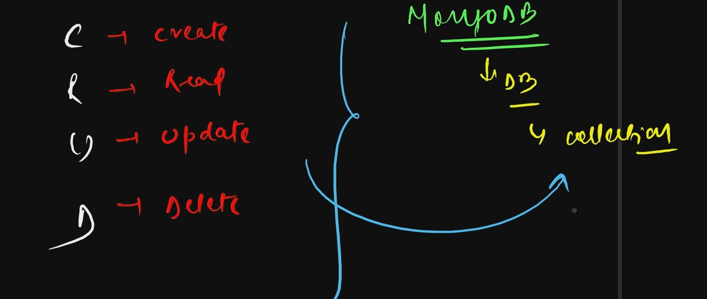

BSON


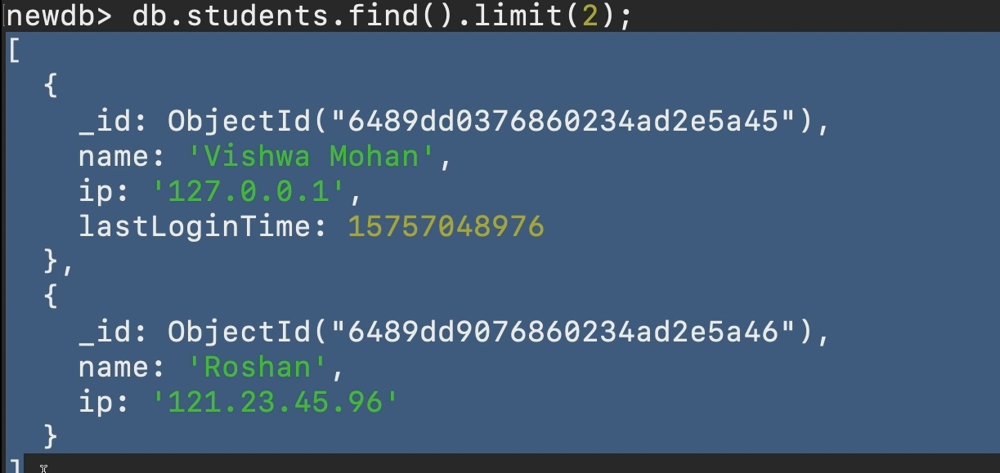

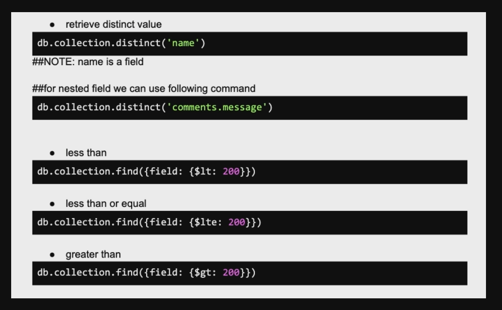

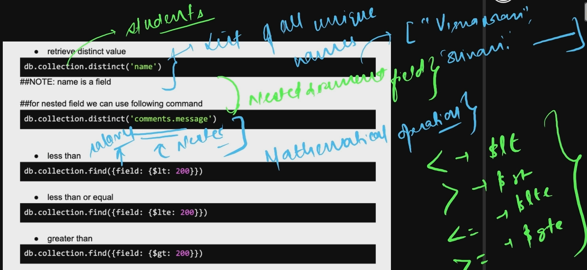
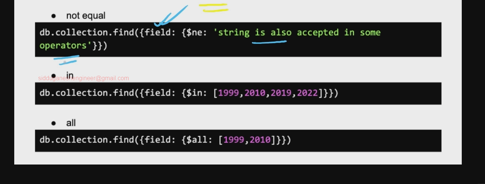


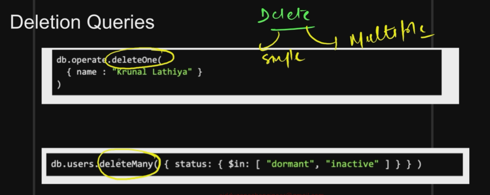

------------------
other topics
Aggregations
Advanced topics
How to optimize the mongoDB
connecting the db.

