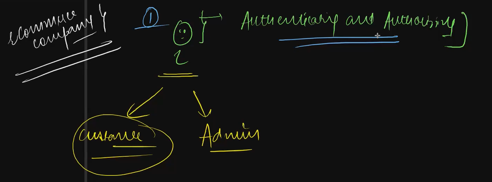
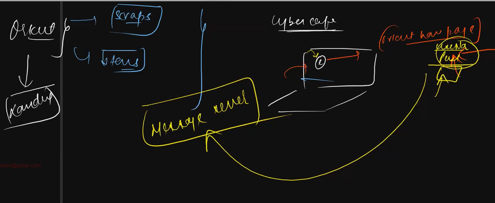

# project : ecommerces

## SetUp
> npm init
> npm install express
> npm install bcryptjs
> npm install mongoose jsonwebtoken

## Code

Building the RestAPI's backend

Authentication and authorization

authentication =
authorization = 

various types of roles of authorization in ecommerces.
customer : 
admin : 

NoSecurity at the earlier days. Over a period of hipe in the internet.
Security became the crucial.
Registration 
Authentication : username, password to login

BasicAuth = everytime username/password then hacker can hack easily.
overly exposed secrets

olden days = > basic auth = pishing attack is easy

today's => token based auth
gets access code 
with the help of access code (ttl = time to live) no need of login username and password 

tokens are for the servers.
cookies are present in the browser.

Multifactor authentication, 1)username/password 2)OTP

customers authentication is done through API
admin is done internally

now we are doing
1)Authentication and Authorization

bencrypt