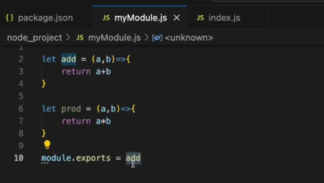
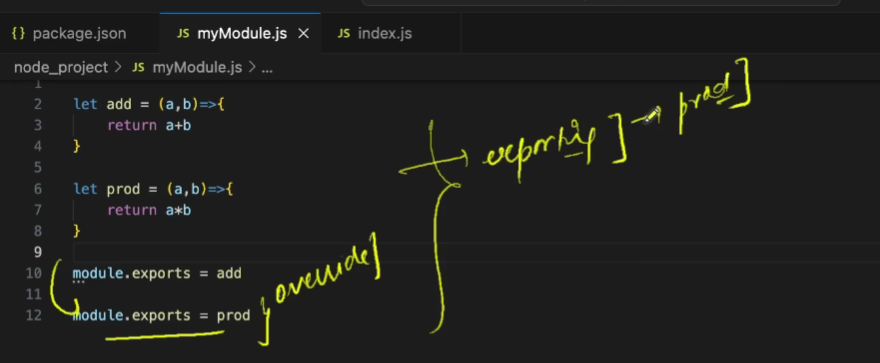
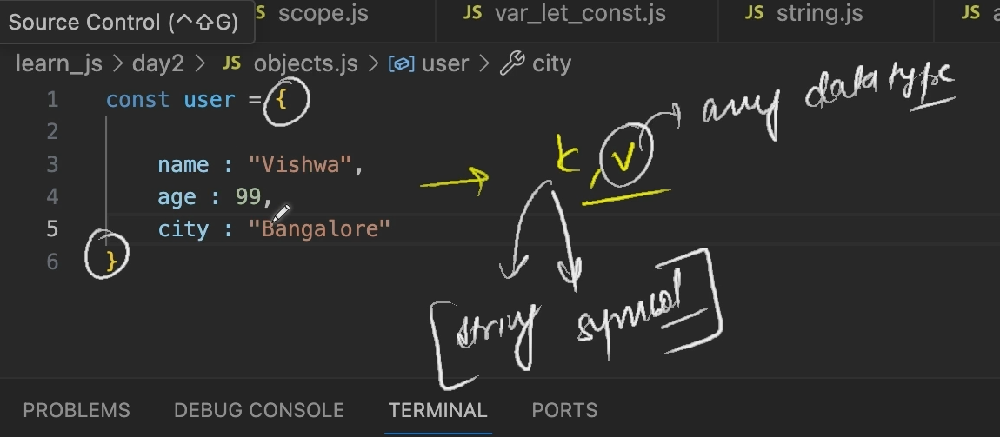
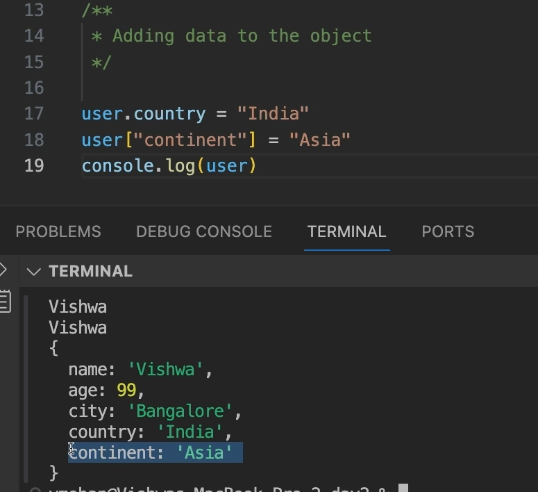
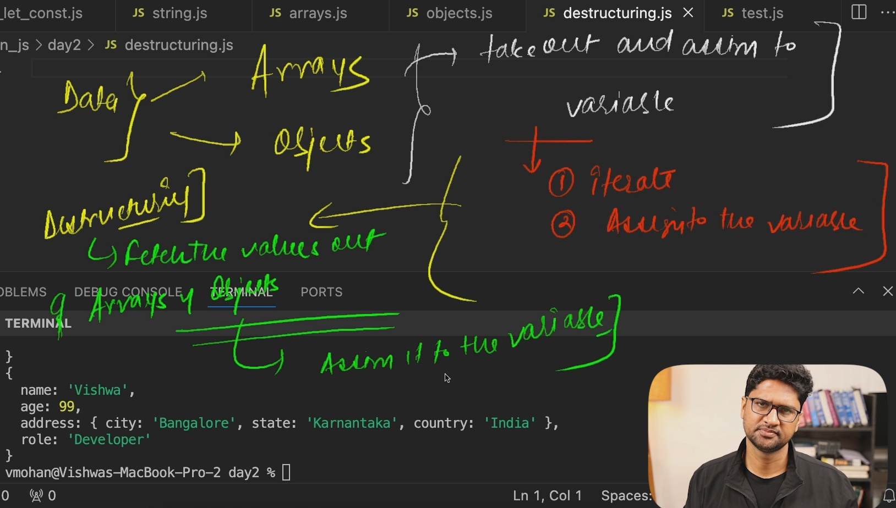
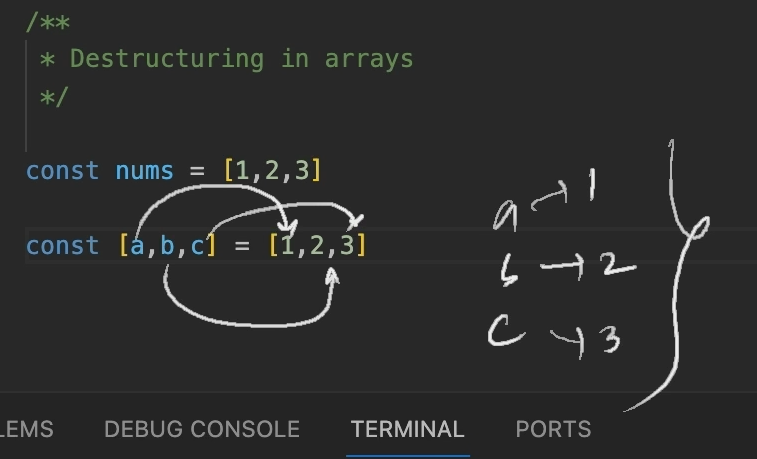

# Variables
In JavaScript, variables are used to store data values. They are containers for holding information that can be referenced and manipulated throughout the execution of a program. Here's a basic overview of variables in JavaScript:

### Declaration and Initialization:
You declare a variable in JavaScript using the `var`, `let`, or `const` keyword followed by the variable name. You can also initialize a variable at the time of declaration by assigning it a value.

```javascript
// Using var (global scope or function scope)
var x;
var name = "John";

// Using let (block scope)
let y;
let age = 30;

// Using const (constant value, cannot be reassigned)
const PI = 3.14;
```

### Naming Conventions:
- Variable names can include letters, digits, underscores, and dollar signs.
- They must begin with a letter, underscore, or dollar sign.
- Variable names are case-sensitive (`age` and `Age` are different variables).
- It's recommended to use meaningful and descriptive names for variables to make your code more readable.

### Data Types:
JavaScript is a dynamically-typed language, meaning you don't need to specify the data type when declaring a variable. The type of data a variable holds can change during the execution of a program.

Common data types include:
- **Primitive types**: `number`, `string`, `boolean`, `null`, `undefined`, `symbol`
- **Composite types**: `object`

### Scope:
- Variables declared with `var` are function-scoped or globally-scoped if declared outside any function.
- Variables declared with `let` and `const` are block-scoped, meaning they are only accessible within the block they are defined in (such as within a loop or if statement).

### Reassignment:
- Variables declared with `var` and `let` can be reassigned new values.
- Variables declared with `const` cannot be reassigned. However, for objects and arrays declared with `const`, their properties or elements can still be modified.

```javascript
let count = 10;
count = 20; // Reassignment is possible with let

const PI = 3.14;
// PI = 3.14159; // This will throw an error because PI is a constant and cannot be reassigned
```

Understanding variables is fundamental to writing JavaScript code, as they are used to store and manipulate data throughout your programs.


# DataTypes
JavaScript is a dynamically-typed language, which means that variables in JavaScript can hold values of any data type without requiring explicit declaration of the data type. Here are the common data types in JavaScript:

1. **Primitive Data Types**:
   - **Number**: Represents numeric values, including integers and floating-point numbers.
   - **String**: Represents textual data enclosed within single ('') or double ("") quotes.
   - **Boolean**: Represents a logical value indicating true or false.
   - **Undefined**: Represents a variable that has been declared but has not been assigned a value yet.
   - **Null**: Represents an intentional absence of any object value.
   - **Symbol**: Introduced in ECMAScript 6 (ES6), represents a unique identifier. Symbols are often used as property keys in objects.
   - **BigInt**: Introduced in ECMAScript 2020, represents integers with arbitrary precision.

2. **Composite Data Type**:
   - **Object**: Represents a collection of key-value pairs, where keys are strings (or symbols) and values can be of any data type, including other objects. Objects are used to store complex data structures.

3. **Special Data Types**:
   - **Function**: In JavaScript, functions are a special type of object that can be invoked (called) to perform a task or calculate a value. They are often used for reusable code blocks.
   - **Array**: In JavaScript, arrays are a special type of object used for storing multiple values in a single variable. Arrays can hold values of any data type, and their elements are accessed by index.

JavaScript also provides methods for determining the type of a variable or value at runtime, such as `typeof` operator and `instanceof` operator.

Example:

```javascript
// Primitive Data Types
let num = 10; // Number
let str = "Hello"; // String
let bool = true; // Boolean
let undef; // Undefined
let n = null; // Null
let sym = Symbol("foo"); // Symbol
let bigInt = 9007199254740991n; // BigInt

// Composite Data Type
let obj = { key: "value" }; // Object

// Special Data Types
function myFunction() {} // Function
let arr = [1, 2, 3]; // Array

// Checking Data Types
console.log(typeof num); // Output: "number"
console.log(typeof str); // Output: "string"
console.log(typeof bool); // Output: "boolean"
console.log(typeof undef); // Output: "undefined"
console.log(typeof n); // Output: "object"
console.log(typeof sym); // Output: "symbol"
console.log(typeof bigInt); // Output: "bigint"
console.log(typeof obj); // Output: "object"
console.log(typeof myFunction); // Output: "function"
console.log(Array.isArray(arr)); // Output: true
```

Understanding data types in JavaScript is crucial for effectively working with variables and writing JavaScript code.

# Operators
In JavaScript, operators are symbols that perform operations on variables or values. They can be used for arithmetic, comparison, logical operations, assignment, and more. Here are some common types of operators in JavaScript:

1. **Arithmetic Operators**: Used to perform arithmetic operations on numbers.
   - Addition (+)
   - Subtraction (-)
   - Multiplication (*)
   - Division (/)
   - Modulus (%)
   - Increment (++)
   - Decrement (--)

2. **Assignment Operators**: Used to assign values to variables.
   - Assignment (=)
   - Addition assignment (+=)
   - Subtraction assignment (-=)
   - Multiplication assignment (*=)
   - Division assignment (/=)
   - Modulus assignment (%=)

3. **Comparison Operators**: Used to compare values.
   - Equal to (==)
   - Not equal to (!=)
   - Strict equal to (===)
   - Strict not equal to (!==)
   - Greater than (>)
   - Less than (<)
   - Greater than or equal to (>=)
   - Less than or equal to (<=)

4. **Logical Operators**: Used to combine or manipulate boolean values.
   - Logical AND (&&)
   - Logical OR (||)
   - Logical NOT (!)

5. **Bitwise Operators**: Used to perform bitwise operations on integers.
   - Bitwise AND (&)
   - Bitwise OR (|)
   - Bitwise XOR (^)
   - Bitwise NOT (~)
   - Left shift (<<)
   - Sign-propagating right shift (>>)
   - Zero-fill right shift (>>>)

6. **Unary Operators**: Operate on a single operand.
   - Unary plus (+)
   - Unary negation (-)
   - Increment (++)
   - Decrement (--)
   - Logical NOT (!)
   - Typeof (typeof)
   - Void (void)
   - Delete (delete)

7. **Ternary Operator (Conditional Operator)**: Used for decision making.
   - Conditional (ternary) operator (condition ? expr1 : expr2)

These operators are fundamental to performing various tasks and computations in JavaScript programming.

# Conditionals
In JavaScript, conditionals are used to execute different code blocks based on specified conditions. The most common types of conditionals in JavaScript are the `if` statement, the `if...else` statement, the `else if` statement, and the `switch` statement. Here's how they work:

### 1. `if` Statement:
The `if` statement executes a block of code if a specified condition is true.

```javascript
let x = 10;
if (x > 5) {
    console.log("x is greater than 5");
}
```

### 2. `if...else` Statement:
The `if...else` statement executes one block of code if a specified condition is true and another block of code if the condition is false.

```javascript
let x = 10;
if (x > 5) {
    console.log("x is greater than 5");
} else {
    console.log("x is not greater than 5");
}
```

### 3. `else if` Statement:
The `else if` statement allows you to specify a new condition to test if the previous condition(s) were false.

```javascript
let x = 10;
if (x > 10) {
    console.log("x is greater than 10");
} else if (x === 10) {
    console.log("x is equal to 10");
} else {
    console.log("x is less than 10");
}
```

### 4. `switch` Statement:
The `switch` statement evaluates an expression and executes the code associated with the matching case label. It's often used when there are multiple conditions to evaluate.

```javascript
let fruit = "Apple";
switch (fruit) {
    case "Apple":
        console.log("Selected fruit is Apple");
        break;
    case "Banana":
        console.log("Selected fruit is Banana");
        break;
    default:
        console.log("Unknown fruit");
}
```

### Ternary Operator:
The ternary operator (`condition ? expr1 : expr2`) provides a shorthand way of writing `if...else` statements. It evaluates the condition and returns one of two expressions depending on whether the condition is true or false.

```javascript
let age = 18;
let message = (age >= 18) ? "You are an adult" : "You are a minor";
console.log(message);
```

### Nested Conditionals:
You can also nest conditionals within one another to create more complex logic.

```javascript
let x = 10;
if (x > 5) {
    if (x < 15) {
        console.log("x is between 5 and 15");
    }
}
```

Conditionals are fundamental to controlling the flow of execution in JavaScript programs, allowing for the creation of dynamic and responsive behavior.

# Loops

In JavaScript, loops are used to execute a block of code repeatedly as long as a specified condition is true. There are several types of loops in JavaScript, including the `for` loop, the `while` loop, the `do...while` loop, and the `for...in` loop. Here's an overview of each:

### 1. `for` Loop:
The `for` loop repeats a block of code a specified number of times.

```javascript
for (let i = 0; i < 5; i++) {
    console.log(i); // Output: 0, 1, 2, 3, 4
}
```

### 2. `while` Loop:
The `while` loop repeats a block of code as long as a specified condition is true.

```javascript
let i = 0;
while (i < 5) {
    console.log(i); // Output: 0, 1, 2, 3, 4
    i++;
}
```

### 3. `do...while` Loop:
The `do...while` loop is similar to the `while` loop, but it guarantees that the block of code is executed at least once before checking the condition.

```javascript
let i = 0;
do {
    console.log(i); // Output: 0
    i++;
} while (i < 0);
```

### 4. `for...in` Loop:
The `for...in` loop iterates over the enumerable properties of an object.

```javascript
const obj = { a: 1, b: 2, c: 3 };
for (let prop in obj) {
    console.log(prop + ": " + obj[prop]); // Output: a: 1, b: 2, c: 3
}
```

### 5. `for...of` Loop:
The `for...of` loop is used to iterate over iterable objects such as arrays, strings, maps, sets, etc.

```javascript
const array = [1, 2, 3];
for (let value of array) {
    console.log(value); // Output: 1, 2, 3
}
```

### Nested Loops:
You can nest loops within each other to create more complex iteration patterns.

```javascript
for (let i = 0; i < 3; i++) {
    for (let j = 0; j < 3; j++) {
        console.log(i, j); // Output: (0, 0), (0, 1), (0, 2), (1, 0), (1, 1), (1, 2), (2, 0), (2, 1), (2, 2)
    }
}
```

### Loop Control Statements:
JavaScript provides loop control statements like `break`, `continue`, and `return` to modify the behavior of loops.

```javascript
for (let i = 0; i < 5; i++) {
    if (i === 3) {
        break; // Exit the loop when i equals 3
    }
    console.log(i); // Output: 0, 1, 2
}
```

Loops are fundamental to programming in JavaScript and are commonly used to iterate over arrays, manipulate data, and control program flow.

# something like println and print
In Java, `println` and `print` are methods used for printing output to the console. `println` prints the output and moves the cursor to the next line, while `print` just prints the output without moving the cursor to the next line.

In JavaScript, you can achieve similar functionality for printing output to the console using `console.log()` and `process.stdout.write()`.

1. **console.log()**: This method prints the output and moves the cursor to the next line.

   ```javascript
   console.log("Hello, world!");
   ```

2. **process.stdout.write()**: This method prints the output without moving the cursor to the next line. You might need to append `\n` to the string if you want to move to the next line explicitly.

   ```javascript
   process.stdout.write("Hello, world!\n");
   ```

So, the equivalent of `println` in Java and `print` in Java can be achieved in JavaScript using `console.log()` and `process.stdout.write()`, respectively.

# NOTES DAY1
```javascript
// variable = place where data is stored.
// var is a keyword used to define the variables.

var name //just declared the variable
console.log(name);//undefined

var age = 22 //declared and initialized
console.log(age);

/**
 * Rules of naming variables
 * 1. a-z, A-Z , 0-9 , _ , $
 * 2.keywords (if, else, for...) can't be used for naming
 * 3.No space b/w variables naming is not allowed.
 * 
 * Guidelines/Suggestions
 * 1.Name has to be Meaning full
 * 
 * Observations
 * 1.They are case sensitive.
 */

var hobby
var Nationality
console.log(Nationality);

/////////////////
console.log(4,5,3);
console.log("welcome the JS");
process.stdout.write("Hello, ");
process.stdout.write("Hello, ");
process.stdout.write("world!\n");
process.stdout.write("Hai ");

///////////////
/**
 * Assignment Operators
 * =
 */
var name = "Sidduganesh"
console.log(name);

/**
 * Arithmetic Operators
 * +
 * -
 * *
 * /
 * %
 */
console.log(4+5+53);
console.log(5-1);
console.log(10%2);
console.log(2**2);

//INCREMENT OPERATOR
i=5
console.log("i is "+i++);//5
console.log(i);//6

/** 
 * Relational Operator
 * ==
 * ===
 * !=
 * !==
 * >
 * <
 * >=
 * <=
 */
    //Euality
console.log(100==100)//true
console.log(100=='100');//true
    //Strict Equality = check type also
console.log(100==='100');//false
    //inequality
console.log(100!=100);//false
console.log(100!=='100');//true


/**
 * Logical Operators
 * generic eg :
 * mom make dosa or idle => OR ||
 * MOM and DAD both needed => AND &&
 */
console.log(2>4 && true);//false
console.log(false || true);//true
console.log(true ^ true);//0


/**
 * Bitwise Operators
 * =means numbers are converted into the bits and operations are performed
 */
console.log(10 & 6);//2
console.log(10 | 6 );//14


////////////////////////
//OPERATORS


////////////
//DATA TYPES
//two types
/**
 * 1.Primitive = means simple/immutable
 * 2.Non-Primitive = means complex and mutable.
 */

//Primitive = 8 types => Number, String.....

/** PRIMITIVE DATA TYPES 

//String is a sequence of characters

var fName = "Siddu"
var mName = 'Ganesh'
var lName = "Musa"
console.log("Full Name : "+lName+" "+fName+" "+mName);


//typeof operator

console.log(typeof fName);
console.log(typeof(lName));

//Number
var age = 22;
var height = 5.65;
console.log(typeof height);

//BigInt = indicates the valide bignumber , add suffix of n
var big_num = 73343_23432n;
console.log(typeof big_num);
console.log(big_num);
    //NaN
console.log(typeof NaN);//Number

    //null
console.log(typeof null);//known bug is JS which is not fixed in js
                        //o/p object //null datatype is object

var name
console.log(name);//undefined
//means variable is declared but not initialized
//when var is initialized to null //means it is done intentionally.
var Surname = null
console.log(Surname);


//boolean
console.log(typeof true)


//new datatype in JS
//Symbol
var s2 = Symbol() //() constructor //Symbol object
console.log(typeof s2);//symbol
//to ensure the keys are unique in JS , symbols are used.


PRIMITIVE DATA TYPES ENDED */

//Non-Primitive = object

//to represent something of realworld to programming world we need to represent it as object.
//object has 2 things : attributes/fields/properties and behaviours = oops
//eg: humans compare with car then represent in programming
//OOPS core is object

//syntax => var obj_name = {key: value, key2: value}
//values can be any datatype

//Object
var person = {
    flName : "Siddu Ganesh Musa",
    dob : "09Sep2001"   
}

console.log(person);//{ flName: 'Siddu Ganesh Musa', dob: '09Sep2001' }
console.log(typeof person);//object

///////////////////
//CONDITIONALS
//if
//if else
//nested if else (eg:picknick)
//switch


//sg = 32 && 1032 && "19TU1A0508" ;//last one is asssigned
//sg = 32 || 1032 || "19TU1A0508" ;//first one is assigned

sg = [32, 1032, "19TU1A0508"]
console.log(typeof sg);
console.log(sg);
// if(true);

if(sg[0]==32)
{
    console.log("went to school");
    if(sg[1 ]==1032){
        console.log("went to intermediate");
        if(sg[2]=="19TU1A0508")
            console.log("went to b.tech");
    }

}else{
    console.log("NO");
}

for(i=0;i<50;i++)
{
    if(i%2!=0){
        continue
    }
    console.log(i);
}
////////////////
//LOOPS
//for
//while
//do while


for(var i=0;i<10;)//infinite loop //small virus //olded days = internal lan
{
    console.log("Hello world");
}

/**
 * continue keyword
 */

/**
 * break keyword
 * 
 * in nested then break will terminate only immediate one.
 */

//////////////
//continue and break keywords

```

# Function

In JavaScript, functions are reusable blocks of code that can be defined and called to perform a specific task or calculate a value. Functions are a fundamental building block of JavaScript programming and are used extensively for code organization, modularity, and reusability.

### Defining a Function:
You can define a function using the `function` keyword followed by the function name, a list of parameters enclosed in parentheses (optional), and the code block enclosed in curly braces `{}`.

```javascript
function greet() {
    console.log("Hello, world!");
}
```

### Calling a Function:
You can call a function by using its name followed by parentheses.

```javascript
greet(); // Output: Hello, world!
```

### Function Parameters:
Functions can take parameters, which are values passed into the function when it is called. These parameters act as variables within the function.

```javascript
function greet(name) {
    console.log("Hello, " + name + "!");
}

greet("Alice"); // Output: Hello, Alice!
greet("Bob"); // Output: Hello, Bob!
```

### Return Statement:
Functions can return a value using the `return` statement. This allows the function to calculate a value and then provide it back to the code that called the function.

```javascript
function add(a, b) {
    return a + b;
}

let result = add(3, 5);
console.log(result); // Output: 8
```

### Function Expressions:
Functions can also be defined using function expressions, where a function is assigned to a variable.

```javascript
let greet = function(name) {
    console.log("Hello, " + name + "!");
};

greet("Alice"); // Output: Hello, Alice!
```

### Arrow Functions (ES6): (write less and achieve more)
Arrow functions provide a more concise syntax for defining functions, especially for short, single-expression functions.

```javascript
let greet = (name) => {
    console.log("Hello, " + name + "!");
};

greet("Alice"); // Output: Hello, Alice!
```

### Immediately Invoked Function Expressions (IIFE):
An IIFE is a function that is executed immediately after it's defined. It's often used to create a new scope to avoid polluting the global scope.

```javascript
(function() {
    console.log("This is an IIFE");
})();
```

### Function Scope:
Variables declared inside a function are local to that function and cannot be accessed from outside.

```javascript
function foo() {
    let x = 10; // Local variable
    console.log(x); // Output: 10
}

console.log(x); // Throws an error: x is not defined
```

Functions play a crucial role in JavaScript programming, enabling developers to write organized, reusable, and modular code.

## concept of default values
```javascript
/**
 * I want to get the sum of two numbers
 */
//all the parameters in the function can be possible to give the default values
function sum(a,b = 7){
    return a+b ;
}

console.log(sum(5))
```

## forced arguments
```javascript
function func(){
    //arguments should be albe to detect
    //arguments object
    console.log(arguments)
    

}
func(1,2,3,4,5)//forced the arguments
```

# scope
In JavaScript, scope refers to the visibility and accessibility of variables within your code. Understanding scope is crucial for writing well-structured and maintainable code. JavaScript has two main types of scope:

1. **Global Scope**: Variables declared outside of any function, including variables declared with `var`, are considered to be in the global scope. These variables are accessible from anywhere within the script, including inside functions.

    ```javascript
    var globalVariable = "I'm global";

    function foo() {
        console.log(globalVariable); // Output: I'm global
    }

    foo();
    ```

    However, it's important to be cautious with global variables, as they can lead to naming conflicts and make code harder to maintain.

2. **Local Scope**: Variables declared inside a function are considered to be in the local scope. They are accessible only within the function in which they are declared.

    ```javascript
    function foo() {
        var localVariable = "I'm local";
        console.log(localVariable); // Output: I'm local
    }

    foo();
    // console.log(localVariable); // This will throw an error because localVariable is not defined in the global scope
    ```

    Variables declared with `let` and `const` inside blocks (like loops or if statements) have block scope, meaning they are accessible only within that block.

    ```javascript
    function foo() {
        if (true) {
            let x = 10;
            console.log(x); // Output: 10
        }
        // console.log(x); // This will throw an error because x is not defined in this scope
    }

    foo();
    ```

    It's worth noting that variables declared with `var` have function scope rather than block scope. They are accessible throughout the function in which they are declared, even outside of the block in which they were defined.

    ```javascript
    function foo() {
        if (true) {
            var y = 20;
        }
        console.log(y); // Output: 20
    }

    foo();
    ```

3. **Lexical Scope (Closures)**: In JavaScript, functions can access variables defined in their outer (enclosing) scope, even after the outer function has finished executing. This behavior is known as lexical scope or closures.

    ```javascript
    function outer() {
        var outerVar = "I'm outer";

        function inner() {
            console.log(outerVar); // Output: I'm outer
        }

        return inner;
    }

    var innerFunction = outer();
    innerFunction();
    ```

    Here, `inner` has access to the variable `outerVar`, even though it's declared in the outer scope.

Understanding scope in JavaScript helps you avoid variable conflicts, write cleaner code, and use closures effectively.

# String
In JavaScript, strings are sequences of characters, used to represent text. Strings can be enclosed in single quotes (`'`) or double quotes (`"`), and they can contain any Unicode characters, including letters, digits, special characters, and even emoji. Here's an overview of working with strings in JavaScript:

### Creating Strings:

```javascript
let singleQuotedString = 'This is a single-quoted string';
let doubleQuotedString = "This is a double-quoted string";
```

### Special Characters in Strings:
JavaScript allows the use of special escape sequences in strings to represent characters that are difficult or impossible to type directly into a string literal.

```javascript
let escapedString = "This string contains a newline\nand a tab\tcharacter.";
```

### String Concatenation:
Strings can be concatenated (joined together) using the `+` operator.

```javascript
let firstName = "John";
let lastName = "Doe";
let fullName = firstName + " " + lastName; // Output: "John Doe"
```

### String Length:
The `length` property of a string returns the number of characters in the string.

```javascript
let str = "Hello, world!";
console.log(str.length); // Output: 13
```

### Accessing Characters:
Individual characters within a string can be accessed using bracket notation (`[]`) with a numeric index.

```javascript
let str = "Hello";
console.log(str[0]); // Output: "H"
console.log(str[1]); // Output: "e"
```

### String Methods:
JavaScript provides numerous built-in methods for working with strings, including methods for searching, replacing, splitting, converting case, and more.

```javascript
let str = "Hello, world!";
console.log(str.toUpperCase()); // Output: "HELLO, WORLD!"
console.log(str.indexOf("world")); // Output: 7
console.log(str.replace("world", "John")); // Output: "Hello, John!"
console.log(str.split(", ")); // Output: ["Hello", "world!"]
```

### Template Literals (ES6):
Template literals are a more powerful way to create strings in JavaScript, allowing for embedding expressions and multi-line strings using backticks (`).

```javascript
let name = "Alice";
let greeting = `Hello, ${name}!
How are you today?`;
console.log(greeting);
/*
Output:
Hello, Alice!
How are you today?
*/
```

Strings are essential for handling textual data in JavaScript, and understanding how to work with them effectively is fundamental for JavaScript developers.
## Inbuilt methods of string
JavaScript provides a significant number of built-in methods for working with strings. The exact count may vary depending on the ECMAScript version and the JavaScript environment you are using (such as browsers or Node.js). However, there are a substantial number of string methods available in JavaScript.

A comprehensive list of built-in string methods can be found in the official documentation for JavaScript. Here's a brief summary of some of the commonly used string methods:

1. **Methods for Accessing Characters and Substrings**:
   - `charAt()`, `charCodeAt()`, `concat()`, `indexOf()`, `lastIndexOf()`, `slice()`, `substring()`, `substr()`, `split()`

2. **Methods for Manipulating Case**:
   - `toUpperCase()`, `toLowerCase()`

3. **Methods for Trimming Whitespace**:
   - `trim()`, `trimStart()`, `trimEnd()`

4. **Methods for Searching and Matching**:
   - `startsWith()`, `endsWith()`, `includes()`, `match()`, `search()`, `replace()`

5. **Methods for Encoding and Decoding**:
   - `encodeURIComponent()`, `encodeURI()`, `decodeURIComponent()`, `decodeURI()`

6. **Methods for Concatenation and Repeating**:
   - `concat()`, `repeat()`

7. **Methods for Converting to Other Types**:
   - `toString()`, `valueOf()`

8. **Methods for Iterating Over Characters**:
   - `forEach()`, `forEachCodePoint()`

9. **Methods for Checking Type and Properties**:
   - `length`, `constructor`, `prototype`

This is not an exhaustive list, and there are many more string methods available. You can explore the complete list and detailed documentation on the official Mozilla Developer Network (MDN) website or the ECMAScript specification. Additionally, new methods may be introduced in future ECMAScript versions, so it's always a good idea to stay updated with the latest developments in JavaScript.

# Array
In JavaScript, an array is a special type of object used for storing multiple values in a single variable. Arrays can contain elements of any data type, including numbers, strings, objects, and even other arrays. Arrays are indexed collections, meaning each element in the array is associated with a numeric index representing its position within the array. Here's an overview of working with arrays in JavaScript:

### Creating Arrays:
You can create an array in JavaScript using array literal notation, which consists of square brackets `[]`, and optionally, you can specify initial values separated by commas.

```javascript
let numbers = [1, 2, 3, 4, 5];
let fruits = ["Apple", "Banana", "Orange"];
let mixedArray = [1, "two", true, { key: "value" }];
```

### Accessing Elements:
You can access elements in an array using square bracket notation `[]`, specifying the index of the element you want to access. Array indices are zero-based, meaning the first element has an index of 0, the second has an index of 1, and so on.

```javascript
let fruits = ["Apple", "Banana", "Orange"];
console.log(fruits[0]); // Output: "Apple"
console.log(fruits[2]); // Output: "Orange"
```

### Modifying Elements:
You can modify elements in an array by assigning a new value to a specific index.

```javascript
let fruits = ["Apple", "Banana", "Orange"];
fruits[1] = "Grape";
console.log(fruits); // Output: ["Apple", "Grape", "Orange"]
```

### Array Length:
You can determine the number of elements in an array using the `length` property.

```javascript
let numbers = [1, 2, 3, 4, 5];
console.log(numbers.length); // Output: 5
```

### Adding and Removing Elements:
JavaScript provides several methods for adding and removing elements from arrays, such as `push()`, `pop()`, `shift()`, `unshift()`, and `splice()`.

```javascript
let fruits = ["Apple", "Banana", "Orange"];
fruits.push("Grape"); // Adds "Grape" to the end of the array
console.log(fruits); // Output: ["Apple", "Banana", "Orange", "Grape"]

fruits.pop(); // Removes the last element ("Grape") from the array
console.log(fruits); // Output: ["Apple", "Banana", "Orange"]
```

### Iterating Over Arrays:
You can iterate over the elements of an array using loops like `for` loop, `forEach()`, `for...of` loop, etc.

```javascript
let fruits = ["Apple", "Banana", "Orange"];
for (let i = 0; i < fruits.length; i++) {
    console.log(fruits[i]);
}
// Output:
// "Apple"
// "Banana"
// "Orange"
```

Arrays are versatile data structures in JavaScript and are widely used for storing and manipulating collections of data. They provide powerful methods for working with data efficiently in your JavaScript programs.
## Inbuilt methods of array
JavaScript provides a comprehensive set of built-in methods for working with arrays. The exact count may vary depending on the ECMAScript version and the JavaScript environment you are using (such as browsers or Node.js). However, there are numerous array methods available in JavaScript.

A comprehensive list of built-in array methods can be found in the official documentation for JavaScript. Here's a brief summary of some of the commonly used array methods:

1. **Methods for Adding and Removing Elements**:
   - `push()`, `pop()`, `shift()`, `unshift()`, `splice()`

2. **Methods for Iterating Over Elements**:
   - `forEach()`, `map()`, `filter()`, `reduce()`, `reduceRight()`

3. **Methods for Searching and Manipulating Elements**:
   - `indexOf()`, `lastIndexOf()`, `includes()`, `find()`, `findIndex()`, `sort()`, `reverse()`, `fill()`, `copyWithin()`

4. **Methods for Checking and Manipulating Arrays**:
   - `concat()`, `slice()`, `join()`, `toString()`, `toLocaleString()`

5. **Methods for Checking Type and Properties**:
   - `length`, `constructor`, `prototype`

6. **Methods for Testing Array Contents**:
   - `every()`, `some()`

7. **Methods for Iterating with Iterators**:
   - `entries()`, `keys()`, `values()`

8. **Methods for Working with Sets**:
   - `from()`, `of()`

This is not an exhaustive list, and there are many more array methods available. You can explore the complete list and detailed documentation on the official Mozilla Developer Network (MDN) website or the ECMAScript specification. Additionally, new methods may be introduced in future ECMAScript versions, so it's always a good idea to stay updated with the latest developments in JavaScript.


# Notes of Day 2
```javascript

/**
 * Define a function
 */

function helloStudents(){
    console.log("Hello Students !")
}

helloStudents()


/**
 * I want to get the sum of two numbers
 */
function sum(a,b = 7){
    return a+b ;
}

console.log(sum(5))


function func(){
    console.log(arguments)

}

func(1,2,3,4,5,5,6)
///////////////////
/**
 * fn with no argument and no return
 */
 //var hello = () => console.log("Hello World")

 //hello()


 /**
  * fn with parameters and return
  */

 //var sum = (a,b) => a+b 

 //console.log(sum(5,7))


 /**
  * fn with parametes, multiple lines of fn body
  */
 /**var process = (a,b) => {
     console.log("need tp process")
     console.log(arguments) //arguments object can't be used in it.
     return a*b

 }
 console.log(process(5,6)) **/

 (function(){
    console.log('Hello Students')
 })()


//////////////////
/**
 * Global scope 
 * eg: air is global
 */
/** 
var name = "Vishwa"

console.log(name)


function func(){
    console.log(name)
}

func() **/


/**
 * Local scope/ Function scope variable
 */
/** 
function func(){
    var num = 55
    console.log(num)
}

func()
console.log(num)//error : not defined.

**/


/**
 * Block Scope
 */

{
    var y = 30
    let x = 20
    const z = 50
    console.log(x)
}

console.log(x)//error : not defined
console.log(y)//prints y valube
console.log(z)//error : not defined
///////////////////

//standard practice is to use the let

/**
 * var  :
 *   1. It's used to define a variable
 *   2. It has function scope but no block scope
 *   3. It is hoisted
 */
/** 
function f1(){
    var i=5
    console.log(i)
}

f1()
console.log(i) 

{
   var i =5
}
console.log(i) 

//hoisted //behind the scene i is defined at the top
console.log(i)
var i =23 

console.log(i) **/


/**
 * let 
 * 
 * 1. No hoisting
 * 2. It also has block scope
 

console.log(i)

let i =5


{
    let name = "Vishwa"
}

console.log(name) **/


/**
 * const 
 *   - scope is exactly same as let
 *   - const variables are final, can't be re-assigned a value
 */

const country = "India"

country = "USA"

/////////////
/**
 * String
 * =strings in all programming languages are immutable.
 * => password is immutable
 * => strings are benefitial in highly concurrent applications.
 * =sequence of characters are placed one after another
 * =internal strings are stored as array indexes
 */

//2 ways of declaring a string
let name = 'Vishwa'
let city = "Bangalore"

console.log(name , city)
console.log(typeof name)

/**
 * Accessing character based on index
 * 
 */
console.log(name[0]) 
//index based accessing
console.log(name[3])
console.log(name[11])//undefined

name[2] ="M"
console.log(name)//vishwa
//string is immutable

//length of the string
console.log(name.length)

let first_name = "Vishwa"
let last_name = " Mohan"

let full_name = first_name.concat(last_name)
console.log(full_name)

console.log( first_name + last_name)

//INBUILT METHODS IN STRING
/**
 * covnert that into upper case
 */
console.log(full_name.toUpperCase())

/**
 * Character at any index str[i]
 */
console.log(name.charAt(3))

/**
 * slicing
 */

console.log(full_name) //Vishwa Mohan
console.log(full_name.slice(2))//shwa Mohan
console.log(full_name.slice(2,5))//shw
console.log(full_name.slice(5,2))//empty
console.log(full_name.slice(-5))//Mohan
console.log(full_name.slice(-5,-1))//Moha

/**
 * indexOf
 */
console.log(name.indexOf('z'))


/**
 * trim
 */
let word = " Vishwa "
console.log(word)
console.log(word.trim())

// split
name = "Vishwa Mohan Singh"

console.log(name.split(" "))
console.log(name.split(""))

//string is object is js

///////////////
/**
 * =array is ordered collection of data
 * =stores data based on index
 * =it can store string, numerics, boolean, objects 
 */

/** arr = [1,2,3]

console.log(typeof arr) //object //mutable reference type

arr1 = new Array()

console.log(typeof arr1) //object

console.log(arr1)//[] empty array
**/

/** 
arr = [1,2,3,4,9,8,7,19,21,29,20] //all the elements are placed based on the indexes.

console.log(arr[0]) //1

console.log(arr[7]) //19

console.log(arr[21]) //undefined

console.log(arr[-1]) 
**/

/**
 * Arrays are mutable. We can modify the arrays
 */
//arr[1] =200
//console.log(arr)

/**
 * Insert items in the arrays
 *

arr = [5,7,1,9,8,16]
console.log(arr)

arr.push(11)//inserts the element at the end of array
console.log(arr)

arr.push(99,100,101)//allows to push/add multiple elems at the end of array
console.log(arr)

//ushift method
arr.unshift(999)// allows to insert the elems at the begining of array
console.log(arr)

arr.unshift(9,99,999) // allows to insert the multiple elems at the begining of array
console.log(arr)  */


/**
 * Removing elements
 * 
 */

//pop method
let arr = [5,7,1,9,8,16]

console.log(arr.pop())//removes elem at the end
console.log(arr)

//shift
console.log(arr.shift()) // removes elem at the begining
console.log(arr)

//concat

let a1 = [1,2,3]
let a2 = [5,6]
let r = a1.concat(a2)
console.log(r)//[1,2,3,5,6]

//size of the arr
console.log(a1.length)//fixed size

/**
 * Convert array into strings
 */
chr_arr = ['V', 'i','s', 'h','w','a',' ', 'M','o','h','a','n']

//join
console.log(chr_arr.join())//V,i,s,h,w,a, ,M,o,h,a,n
console.log(chr_arr.join(""))//Vishwa Mohan
console.log(chr_arr.join('$'))//V$i$s$h$w$a$ $M$o$h$a$n

console.log(chr_arr.toString())
console.log(typeof chr_arr.toString())


/**
 * Slicing of the array
 */

/** let nums = [3,4,5,5,6,7,9,11,13,12,10]

console.log(nums.slice(2))//5,5,6,...... starts from 2 position
console.log(nums.slice(2,7))
console.log(nums.slice(5,-1))
console.log(nums.slice(-9,-2))
console.log(nums.slice(2,-1))

console.log(nums) **/


/**
 * Splicing , which modifies the given array
 * =modifies the original array
 *
let numbers = [1,2,3,4,5]
let removed = numbers.splice(2,2) //start from, number of elements remove
let removed = numbers.splice(2,2,11,12,13) //start from, number of elements remove and add
console.log(removed)
console.log(numbers) **/


/**
 * Reverse a given array
 *

let nums  = [4,1,5,7,19,2]
nums.reverse()
console.log(nums) 

let nums  = [4,1,5,7,19,2]
console.log(nums.indexOf(21)) // if not found then returns the -1
console.log(nums.indexOf(19)) //4 //returns the index of the elem 

*/


/**
 * sorting the array
 * to find in fast way then array has to be sorted.
 */
let my_arr = [15,40,1,13,2]
//my_arr.sort() //sorts the array //1,13,15,2,40
//sorting algorithm is default

//below is sorting logic
//my_arr.sort((a,b)=> a-b) //ascending sorting

my_arr.sort((a,b)=> b-a) //descending sorting

console.log(my_arr)
```




```javascript
//OBJECTS
const user = {

    name : "Vishwa",
    age : 99,
    city : "Bangalore"
}

//Accessing the data
//you have to know the key to gets its value
console.log(user.name)//Vishwa // dot notation 
console.log(user['name']) // bracket notation
```

```javascript
/**
 * Adding data to the object
 */

user.country = "India"
user["continent"] = "Asia"

console.log(user)

/**
 * Deleting object keys and object itself
 
delete user.country
console.log(user)

delete user['continent']
console.log(user)*/


let person = {
    name : "Vishwa",
    age : 99,
    address : {
        city : "Bangalore",
        state : "Karnantaka",
        country : "India"
    }
}

for ( let key in person){
    console.log(key, " => ", person[key])
}


console.log(Object.keys(person)) //degree of leve 1 // to get the keys //[ ,  , ]

console.log(Object.values(person)) // to get values

//Get both keys and the values
console.log(Object.entries(person))


/**
 * Cloning an object using assign
 */
const new_person = Object.assign({}, person)
console.log(new_person) //cloning the existing object

const  new_person_1 = Object.assign({}, person, {role : "Developer"})
console.log(new_person_1) //cloning the existing object and adding additinal features
///////////
//DESTRUCTURING
//data stored mostly in the form of arrays and objects 
//to fetch values out and assign to variables, destructuring is best suited
```


```javascript
/**
 * Destructuring in arrays
 */

/** */
const nums = [1,2,3]

const [a,b,c,d] = [1,2,3]
console.log(a)
console.log(b)
console.log(c)
console.log(d)//undefined

const [a,b] = [1,2,3]
console.log(a)
console.log(b)
console.log(c)//error: not defined


const [p,q,r] = [1,2,[4,5,6]]

console.log(p)
console.log(q)
console.log(r) //[4,5,6]


/**
 * Destructuring in an object
 */

const person2 = {
    age : 99,
    name : "Vishwa",
    city : "Bangalore",
    address : {
        city : "Banaglore",
        state : "karnataka"
    }
}

const  { name, age, address : {city, state} } = person2

console.log(name)
console.log(age)
console.log(city)
console.log(address)//error


```
# end