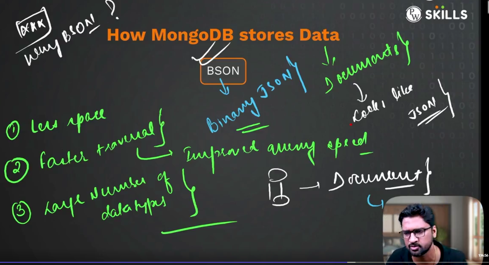
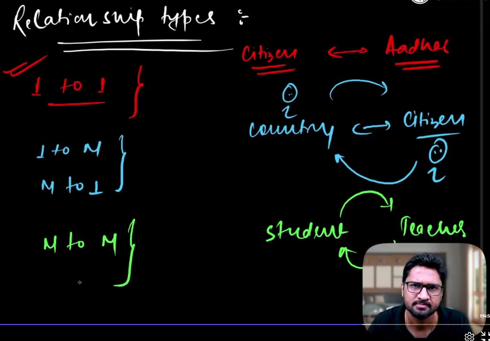

# Backend Development
Practical Code : refer : AllinOneJS_BE.js

<!--

some layer that provides the data
backend is where the data logic is provided.
backend is where the data is stored.
Backend is the server side of the application.
Backend is the brain of the application.

Java/ Spring Boot
JS/Node.js/ Express.js 
( optional : / Nest.js/ Koa.js/ Sails.js/ Meteor.js/ Loopback.js/ Hapi.js/ Adonis.js/ Feathers.js )
Python/ Django
Ruby/ Ruby on Rails
PHP/ Laravel
C#/.NET
Go/ GoLang/ Revel/ Beego
-->

<!--
Modern Web apps follow a 3-tier architecture
1. Frontend
2. Backend
3. Database

Frontend is the client side of the application
Frontend is the user interface of the application
Frontend is the presentation layer of the application
Frontend is the face of the application

Backend is the server side of the application
Backend is the brain of the application
Backend is the data layer of the application
Backend is the logic layer of the application

Database is the storage layer of the application
Database is the data layer of the application
Database is the persistence layer of the application

FE with BE and DB is a 3-tier architecture

-->

to ensure the minimum quality we use frameworks and libraries

- Backend Development is 3 different layers
1. Routes
2. Controllers
3. Models

<!--
Receptionist (Frontend) -> Manager (Backend) -> Database (Database)

Receptionist (Routes works is acknowledge the request and validate the request and then pass it to the controller)
Waiter (controller where logic is written and then pass it to the model)
(main player is the waiter )
Chef (Model where the data is stored and then pass it to the controller)

Routes works is to receive the request and verify and validate the request and then pass it to the 
-->

First build the model and then build the controller and then build the routes

<!--
OUTCOMES
Job
Startup
Freelancing

Build Your Brand

eg. Apple
Apple know well how to do the marketing.
Have skills and Brand yourself
connect with right people and build your network
(#top1PercentTechiesWithVishwa - linkedIn - for 21Days is backend)
-->

- postman is a tool through which we can test the backend api and call api and check the response

- tokens has to be used for the security purpose and tokens has life span and after that it will expire

- JWT token is used for the security purpose and it is a json web token

---
<!--Day 1 -->
NodeJS (runtime of JS)
NodeJS is a runtime environment that allows us to run javascript on the server side.
NodeJS build on V8 engine which is a open source javascript engine developed by google.

search in G : > Install NodeJS
https://nodejs.org/en/download/
download the LTS version as per system requirement.

AFTER INSTALLATION
open cmd and type node -v (enter)
type npm -v

## History of Javascript

JS is single threaded programming language and it is non-blocking and asynchronous language.

## Features of JS

JS uses asynchronous programming and it is non-blocking language and ensures that the code is executed in a sequence.

## Applications of JS
 
IoT - Internet of Things

## IDE we use VSCode
https://code.visualstudio.com/download
(free, handy, light weight, easy to use, has a lot of extensions)

<!--

eg.

-->

# Variables
- Variables are used to store the data in the memory and then we can use the data in the program and then we can perform the operations on the data and then we can display the data 

- var, let, const
var is deprecated in modern practices and we use let and const

To Represent the real world entities we use objects

&

|

fucntion is a block of code that can be reused and it can be called multiple times and it can be called from anywhere in the program

function has arguments

arrow function

arguments is not good in arrow function

IIFE

 SCOPE

GLOBAL SCOPE

FUCNTION SCOPE

BLOCK SCOPE

var let const
----

const is exaactly same as let but the only difference is that we cannot reassign the value to the const variable

pyramid of doom
// callback hell

solved through promises and async await

PROMISE

(Async can take multiple request at a time and it can be executed in parallel and it can be executed in sequence)

EXCEPTION HANDLING

js completed
---

<!--

-->

NodeJS
----

NodeJS is a runtime environment that allows us to run javascript on the server side.
NPM is a package manager for nodejs and it is used to install the packages and libraries and it is used to manage the packages and libraries.

creating node project

-------------
MongoDB
---

MongoDB is a NoSQL database and it is a document oriented database and it is a schema less database and it is a open source database and it is a cross platform database and it is a high performance database and it is a high availability database and it is a horizontal scalable database and it is a distributed database and it is a general purpose database and it is a document store database and it is a json database and it is a binary json database and it is a bson database and it is a non relational database and it is a non transactional database and it is a non acid database and it is a non sql database and 

structure of MongoDB

Scalability

FIXED SCHEMA : eg. kyc, passport, pan, etc.
Flexible Schema : eg. user, ecommerce product (household, electronics, etc.)

flexible schema solution is : mongodb

product : CMS , social media's

sharding

Document can store 16MB of data maximum

network overhead is reduced

embedded documents
relation ship using references